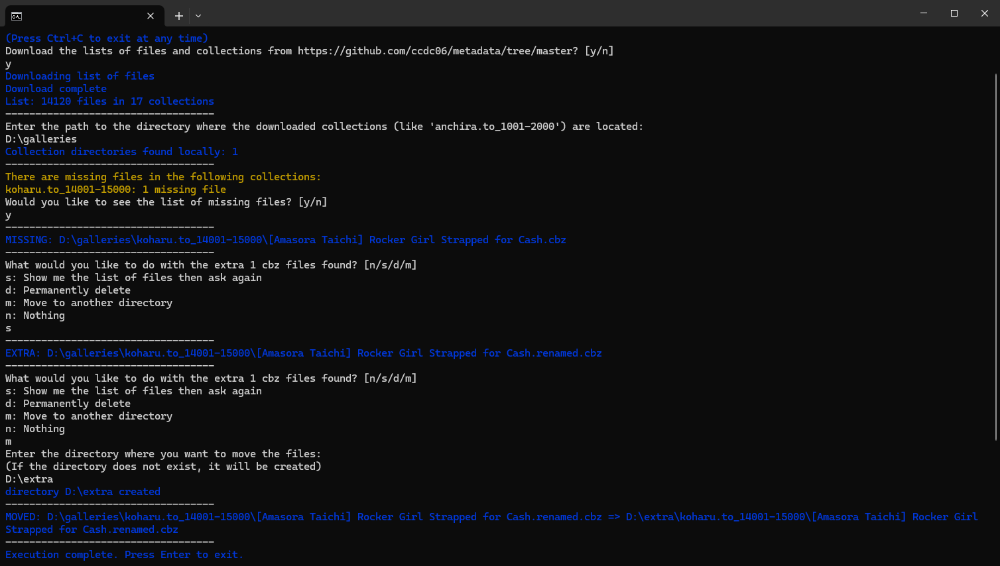

# Tidy

This is a tool to check for missing and unknown .cbz files inside the directories of my torrent releases.

For the tool to work, the directories must be kept with their original names as listed [here](https://github.com/ccdc06/metadata/blob/master/indexes/collections.csv).

# Demo run

For a directory like this:

```md
D:\galleries\
    koharu.to_14001-15000\
        [Amasora Taichi] Rocker Girl Strapped for Cash.renamed.cbz
        [Asano Yomichi] Blue Curaçao (Comic Bavel 2024-07).cbz
        [Ayakawa Riku] Eyeing the Hot Elf in Another World 6.cbz
        [Ayane] Aki Is Thinking.cbz
        [Ayane] Let's Have a Honeymoon.cbz
        (...)
```
(note that the first file was renamed to .renamed.cbz to test for both removals and additions)

The program works like this:



And leaves the directories like this:
```md
D:\galleries\
    koharu.to_14001-15000\
        [Asano Yomichi] Blue Curaçao (Comic Bavel 2024-07).cbz
        [Ayakawa Riku] Eyeing the Hot Elf in Another World 6.cbz
        [Ayane] Aki Is Thinking.cbz
        [Ayane] Let's Have a Honeymoon.cbz
        (...)
D:\extra\
    koharu.to_14001-15000\
        [Amasora Taichi] Rocker Girl Strapped for Cash.renamed.cbz
```
